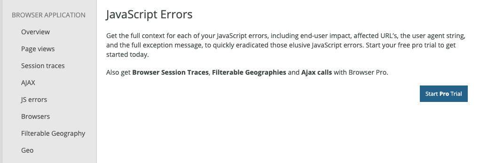
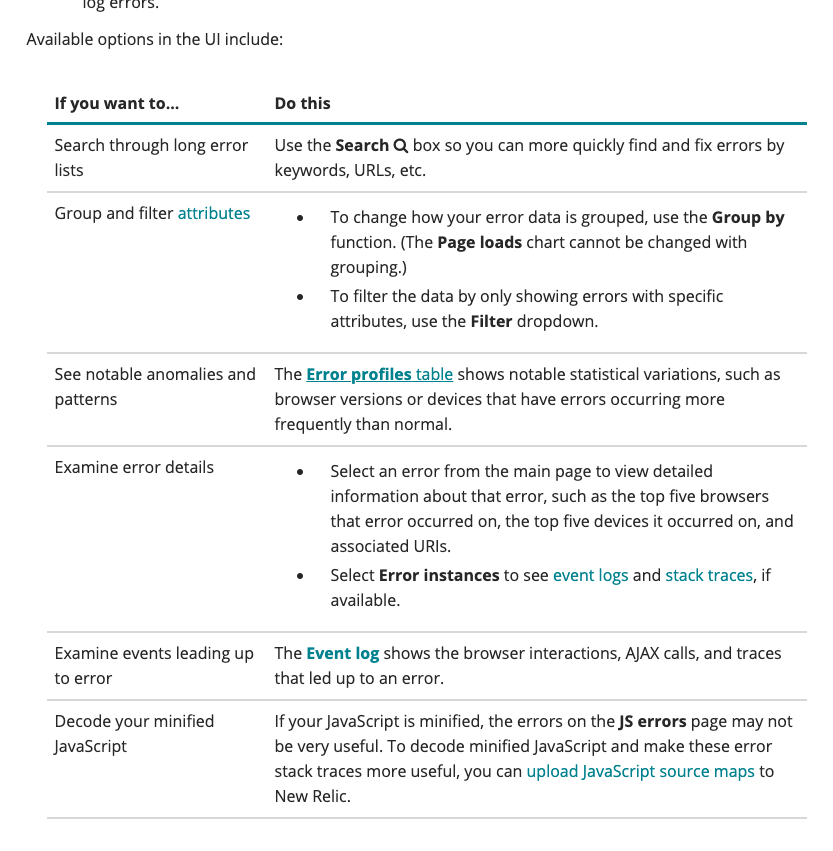
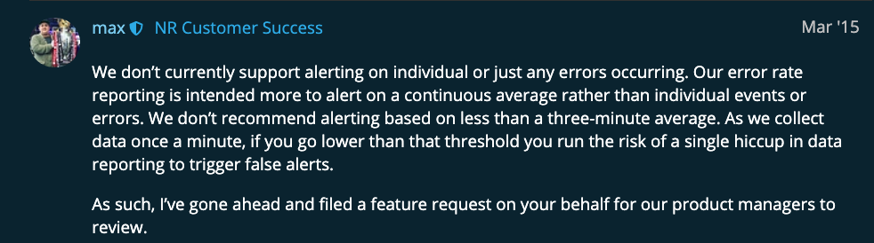
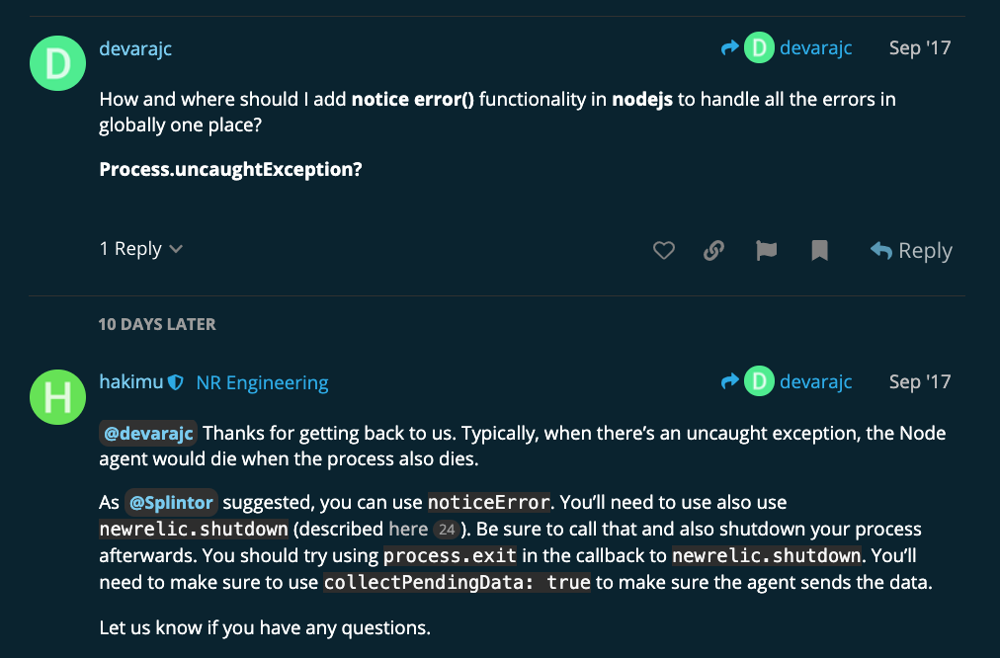
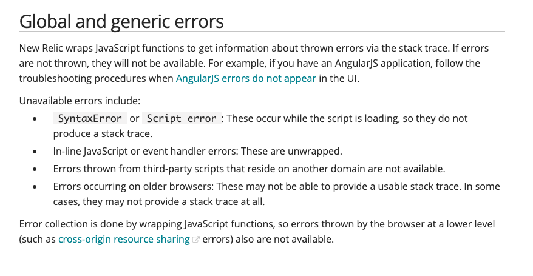
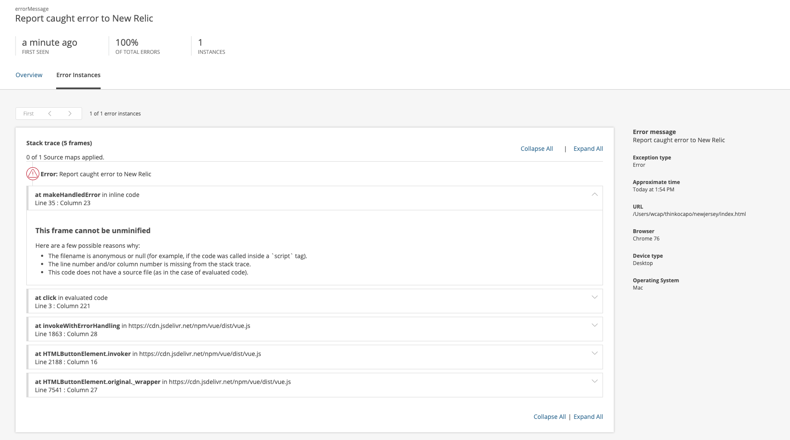
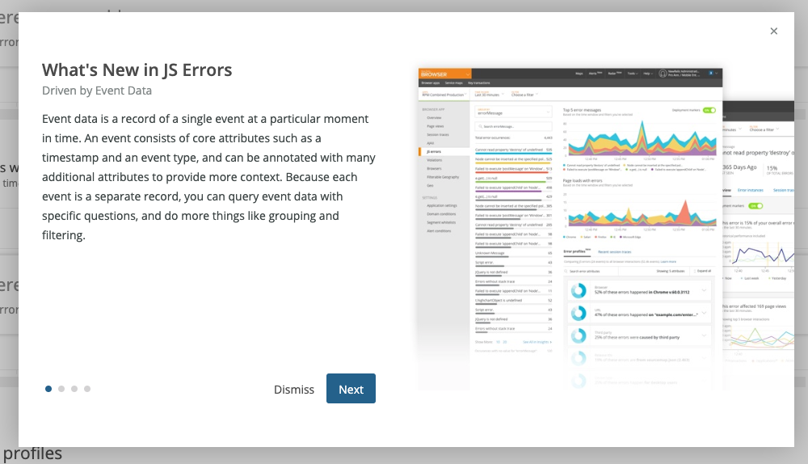
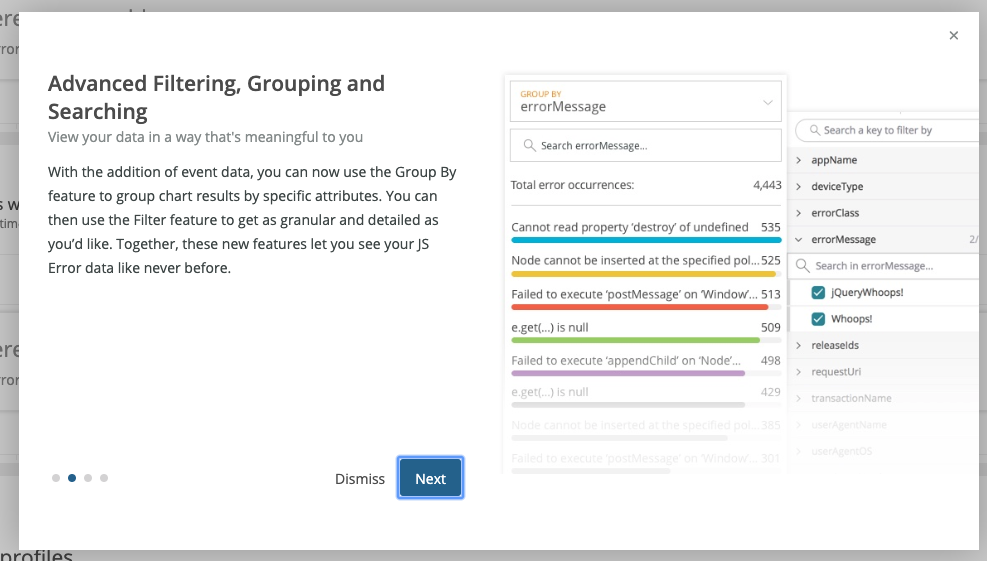
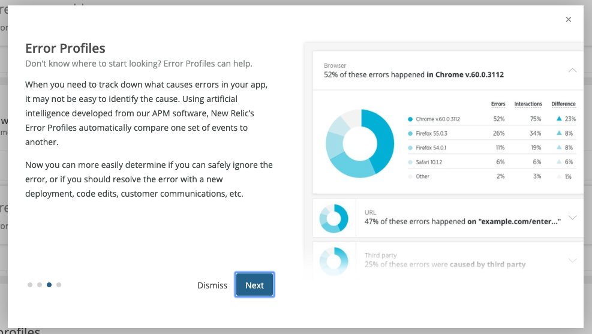
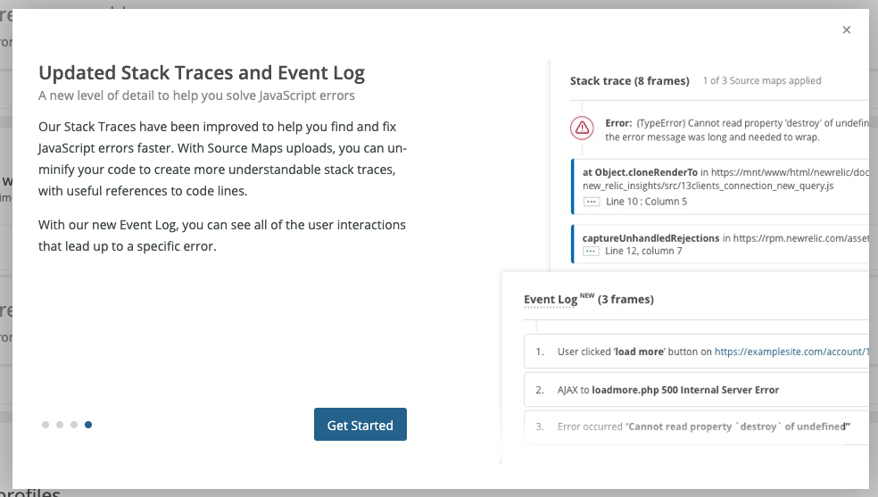

# Overview
This was performed 08/06/19
1. open the `index.html` in your browser
2. this app uses https://vuejs.org/v2/guide/

## Learned
- Two Ways to Install - by cdn javascript OR agent-based (server-side where the SPA js/html is being delivered from. Its more setup but essential if integrating other back-end APM solutions)
- need Pro Free Trial to capture JS errors  
- Only get access to about half of these things unless you do Pro Trial  

- The Browser Pro features are: https://docs.newrelic.com/docs/browser/new-relic-browser/browser-pro-features
- [Javascript Errors](https://docs.newrelic.com/docs/browser/new-relic-browser/browser-pro-features/javascript-errors-page-detect-analyze-errors)
- https://docs.newrelic.com/docs/browser/new-relic-browser/browser-pro-features/javascript-errors-page-detect-analyze-errors#ui-features  
- Newjersey "wraps JavaScript functions to get information about thrown errors via the stack trace", see screenshot below
- what they really emphasize is "Available options in UI"  


## Does Well/Different
- "Top 5 Errors by Count" see `/img/js-error-view.png`. This is not a default view in Ours and even in Issues Dashboard you can select a TimeRange but the event count for that Issue is still an all-time value (i.e. it ignores the date range selected). Definitely something a Champion user could ding us for if we don't fix this asap. HOWEVER the new Events view in beta (as of 08/07/19) solves this.  Can do it in Discover but that's too much work.  
- ["SPA Monitoring"](https://docs.newrelic.com/docs/browser/single-page-app-monitoring/get-started/install-single-page-app-monitoring-new-relic-browser) feature, branded as such. Marketing.  
- APM features, load times.

## Does Poorly
  
and  
  

Newjersey doesn't report all the same errors that ours does?  
It says "in-line javascript" are not caught, is this equivalent to 'uncaught exceptions'?  
  
Does this explain why I can't get Newjersey to capture:
```
var x = {}
x.keyDoesntExist()
```
?
 
Does ours have these problems?  
"Its not picking up my errors and sending to NewRelic"  
https://discuss.newrelic.com/t/browser-agent-not-logging-js-errors/55998/6  

Does ours have these problems?
"Tips for properly installing newrelic browser in your index.html"  
https://docs.newrelic.com/docs/browser/new-relic-browser/page-load-timing-resources/instrumentation-browser-monitoring#javascript-placement 

## Example of "reported" error by the newjersey sdk
```
var err = new Error('Report caught error to New Relic');
newrelic.noticeError(err);
```


## Pro-Trial Onboarding
These are the pop-ups they give you when you Activate Pro Trial (which gives access to full JS Errors)  
  
  
  
  

## Other
- Definition of a Newjersey [Event](https://docs.newrelic.com/docs/using-new-relic/welcome-new-relic/get-started/glossary#event)
- Definition of a Newjersey [Attribute](https://docs.newrelic.com/docs/using-new-relic/welcome-new-relic/get-started/glossary#attribute) which is like a Tag
- has [sourcemaps uploading](https://docs.newrelic.com/docs/browser/new-relic-browser/browser-pro-features/upload-source-maps-un-minify-js-errors)
